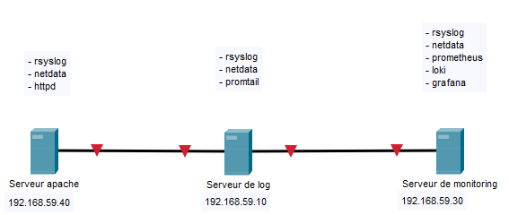

# Solution de monitoring et de centralisation de logs

Solution de monitoring et de centralisation de logs open source

---

# Sommaire

* [Configuration](#Configuration)
* [Installation](#Installation)
* [Exploitation](#Exploitation)

---

## Configuration

### Schéma / Adressage



### Configuration des serveurs

* **CentOS8**
* **1 coeur**
* **1GB** de RAM
* **8GB** d'espace disque

Tous les serveurs sont mis à jour avec la commande ```yum update -y```.

---

## Installation

### Serveur Web

Le serveur web est un serveur apache classique installé avec la commande ```yum install httpd -y```.
Ce serveur nous sert uniquement pour tester les logs d'un service web.

Nous y avons ensuite ajouté l'outil [Netdata](https://www.netdata.cloud).
Netdata est un outil open source qui permet de visualiser et surveiller les performances (CPU,RAM,Disque...) en temps réel.

L'installation s'est faite avec la commande ```bash <(curl -Ss https://my-netdata.io/kickstart.sh)``` donnée par Netdata.

On ouvre ensuite le port 19999 de Netdata : ```firewall-cmd --permanent --add-port=19999/tcp```

La dernière chose réalisée sur ce serveur est la modification du fichier ```/etc/rsyslog.conf```.
Nous y ajoutons à la fin ```*.* @192.168.59.10:514``` pour envoyer les logs de tous les services vers cette adresse (serveur de log).

### Serveur de log

Le serveur de log nous permet de centraliser les logs des deux autres serveurs. Ceci est possible grâce à l'outil [Rsyslog](https://www.rsyslog.com/).
Rsyslog va nous permettre de rassembler tous les logs de plusieurs machines sur une seule. Cela facilite la gestion des logs.

La configuration sera différente des autres serveurs car c'est ce serveur qui reçoit les logs.
Voici les modifications sur le fichier ```/etc/rsyslog.conf``` :

Ligne 21 ```$ModLoad imudp```
Ligne 22 ```$UDPServerRun 514```

Puis à la fin :  
```$template syslog,"/var/log/machines/%hostname%/%PROGRAMNAME%.log"```
```*.* ?syslog```

On ouvre ensuite le port 514 pour recevoir les logs :
```firewall-cmd --permanent --add-port=514/udp```

Nous intégrons ensuite Netdata comme sur le serveur web.

Enfin, nous allons installer [Promtail](https://github.com/grafana/loki/tree/master/docs/clients/promtail).
Promtail est un outil qui permet d'envoyer le contenu d'un fichier. Cela va nous servir pour visualiser les logs sur Grafana.

Les étapes de l'installation :
```
mkdir /opt/promtail && cd /opt/promtail
wget https://github.com/grafana/loki/releases/download/v1.3.0/promtail-linux-amd64.zip
unzip promtail-linux-amd64.unzip
vim config.yml
```

On y ajoute la configuration de promtail :
```
# Promtail Server Config
server:
  http_listen_port: 9080
  grpc_listen_port: 0

# Positions
positions:
  filename: /tmp/positions.yaml

# Loki Server URL
clients:
  - url: http://192.168.59.30:3100/loki/api/v1/push

scrape_configs:
  - job_name: web
    static_configs:
      - targets:
          - 192.168.59.10
        labels:
          job: httpd
          host: 192.168.59.10
          __path__: /var/log/machines/web/httpd.log
  - job_name: sshd
    static_configs:
      - targets:
          - 192.168.59.10
        labels:
          job: sshd
          host: 192.168.59.10
          __path__: /var/log/machines/web/sshd.log
  - job_name: prometheus
    static_configs:
      - targets:
          - 192.168.59.10
        labels:
          job: prometheus
          host: 192.168.59.10
          __path__: /var/log/machines/monitoring/prometheus.log
```

On crée ensuite le fichier ```/etc/systemd/system/promtail.service``` afin de gérer l'outil avec systemctl :
```
[Unit]
Description=Promtail
Documentation=https://github.com/grafana/loki

[Service]
ExecStart=/opt/promtail/promtail-linux-amd64 -config.file /opt/promtail/config.yml

[Install]
WantedBy=multi-user.target
```

### Serveur de monitoring

Le serveur de monitoring permet de visualiser toutes les performances des serveurs ainsi que de consulter les logs de certains fichiers.

Tout d'abord, nous installerons Netdata comme sur les précédents serveurs.
On configure ensuite le fichier ```/etc/rsyslog.conf``` comme sur le serveur web pour envoyer les logs : ```*.* @192.168.59.10:514```.

Nous allons passer à l'installation de [Loki](https://grafana.com/oss/loki/).
Loki est un outil qui permet de récuperer le contenu des fichiers à partir de l'outil Promtail, installé sur le serveur de logs.

Voici les étapes d'installation :
```
cd /usr/local/bin
wget https://github.com/grafana/loki/releases/download/v1.3.0/loki-linux-amd64.zip
unzip loki-linux-amd64.zip
chmod a+x loki-linux-amd64
vim config-loki.yml
```
On y ajoute la configuration de loki :
```
auth_enabled: false

server:
  http_listen_port: 3100

ingester:
  lifecycler:
    address: 127.0.0.1
    ring:
      kvstore:
        store: inmemory
      replication_factor: 1
    final_sleep: 0s
  chunk_idle_period: 5m
  chunk_retain_period: 30s

schema_config:
  configs:
  - from: 2018-04-15
    store: boltdb
    object_store: filesystem
    schema: v9
    index:
      prefix: index_
      period: 168h

storage_config:
  boltdb:
    directory: /tmp/loki/index

  filesystem:
    directory: /tmp/loki/chunks

limits_config:
  enforce_metric_name: false
  reject_old_samples: true
  reject_old_samples_max_age: 168h

chunk_store_config:
  max_look_back_period: 0

table_manager:
  chunk_tables_provisioning:
    inactive_read_throughput: 0
    inactive_write_throughput: 0
    provisioned_read_throughput: 0
    provisioned_write_throughput: 0
  index_tables_provisioning:
    inactive_read_throughput: 0
    inactive_write_throughput: 0
    provisioned_read_throughput: 0
    provisioned_write_throughput: 0
  retention_deletes_enabled: false
  retention_period: 0
```

On crée ensuite le fichier ```/etc/systemd/system/loki.service``` afin de gérer l'outil avec systemctl :
```
[Unit]
Description=Loki service
After=network.target

[Service]
Type=simple
ExecStart=/usr/local/bin/loki-linux-amd64 -config.file /usr/local/bin/config-loki.yml

[Install]
WantedBy=multi-user.target
```

On ouvre ensuite le port 3100 pour que Grafana puisse récuperer les logs :
```firewall-cmd --permanent --add-port=3100/tcp```.

Nous installons maintenant [Prometheus](https://prometheus.io/).
Prometheus est un outil qui permet de visualiser les performances d'une machine. Dans notre cas, il récupère les informations données par Netdata.

Voici les étapes d'installation :
```
mkdir /opt/prometheus && cd /opt/prometheus
wget https://github.com/prometheus/prometheus/releases/download/v2.17.1/prometheus-2.17.1.linux-amd64.tar.gz
tar -xvf prometheus-2.17.1.linux-amd64.tar.gz
vim prometheus.yml
```
On y ajoute la configuration de prometheus :
```
scrape_configs:
  # The job name is added as a label `job=<job_name>` to any timeseries scraped from this config.
  - job_name: 'prometheus'

    # metrics_path defaults to '/metrics'
    # scheme defaults to 'http'.

    static_configs:
      - targets: ['localhost:9090']

  - job_name: 'netdata'

    metrics_path: /api/v1/allmetrics
    params:
      format: [ prometheus ]

    static_configs:
      - targets: ['192.168.59.30:19999']

  - job_name: 'netlog'

    metrics_path: /api/v1/allmetrics
    params:
       format: [ prometheus ]

    static_configs:
      - targets: ['192.168.59.10:19999']

  - job_name: 'netweb'

    metrics_path: /api/v1/allmetrics
    params:
       format: [ prometheus ]

    static_configs:
      - targets: ['192.168.59.40:19999']
```

On crée ensuite le fichier ```/etc/systemd/system/prometheus.service``` afin de gérer l'outil avec systemctl :
```
[Unit]
Description=Prometheus

[Service]
ExecStart=/opt/prometheus/prometheus --config.file /opt/prometheus/prometheus.yml

[Install]
WantedBy=multi-user.target
```

Enfin, nous allons installer [Grafana](https://grafana.com/). Grafana va nous permettre de réaliser des dashboards grâce aux informations de Prometheus. Nous allons aussi regarder les fichiers de logs récupérés par Loki.

Voici les étapes d'installation :
```
wget https://dl.grafana.com/oss/release/grafana-6.7.1-1.x86_64.rpm
sudo yum install grafana-6.7.1-1.x86_64.rpm
```

On ouvre ensuite le port 3000 pour accéder à l'interface de Grafana :
```firewall-cmd --permanent --add-port=3000/tcp```.

Les identifiants par défaut sont admin:admin.

---

## Exploitation

Pour tous les outils installés, les commandes d'exploitation sont les mêmes :

### Démarrer un service
```systemctl start [service]```

### Arrêter un service
```systemctl stop [service]```

### Regarder les statuts d'un service
```systemctl status [service]```

### Activer un service au démarrage
```systemctl enable [service]```
